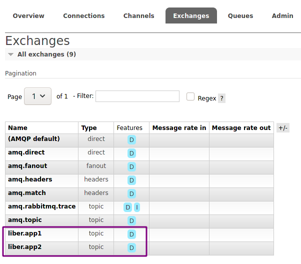
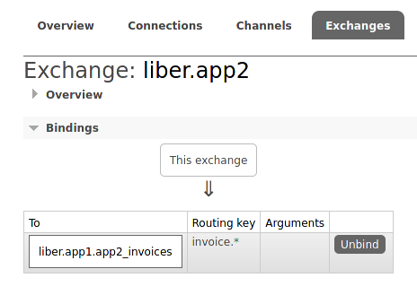
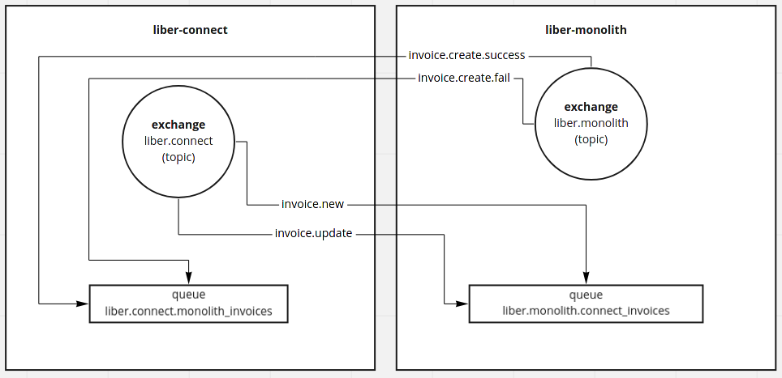

# Padrões para RabbitMQ na Liber

Este documento deve ser usado como guia para o padrão de configuração de troca de mensagens usando RabbitMQ na Liber.

Os exemplos neste documento consideram duas aplicações com nomes app1 e app2.

## Exchanges

Cada aplicação deve ter um único exchange do tipo [topic](https://www.rabbitmq.com/tutorials/amqp-concepts.html#exchange-topic), com nome no formato: `liber.<nome-da-aplicação>`.

Desta forma, fica claro <u>quem</u> está enviando a mensagem. A aplicação app1 enviará suas mensagens pelo exchange liber.app1, enquanto a aplicação app2 publicará suas mensagens no exchange liber.app2.

## Queues e bindings

Cada aplicação deve usar uma ou mais filas, com nomes no formato: liber.<nome-aplicação>.<tópico> .

O parâmetro `tópico` é composto pelo nome da aplicação que publicou a mensagem e pelo tipo de dado/assunto da mensagem.

Os exchanges devem conter bindings de acordo com as routing keys utilizadas, buscando a melhor forma de agrupar mensagens de tópicos similares com as respectivas queues.

## Exemplos

Como exemplo, suponha que a app2 irá enviar mensagens sobre status de invoices para a app1:

- app2 publica uma mensagem para a app1 no exchange liber.app2
  - O exchange segue o padrão de nome, de acordo com o nome da app.

- A mensagem publicada contém a routing key `invoice.accepted`
  - A routing key é concisa e contém de forma clara o assunto/tópico da mensagem.

- O exchange liber.app2 contém um binding que direciona as mensagens do tipo `invoice.*` (ou mais específico) para uma queue chamada liber.app1.app2_invoices
  - O binding direciona mensagens com tópicos semelhantes para a fila destinada àquele tópico/assunto.

- app1 consome mensagens da queue liber.app1.app2_invoices

  - Fica claro quem está consumindo, quem enviou e qual o assunto.

Exemplo feito com as aplicações liber-connect e liber-monolith.

Fonte: https://miro.com/app/board/o9J_lJYTpEs=/
